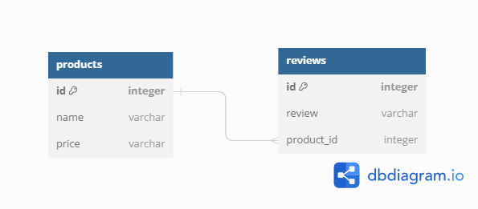
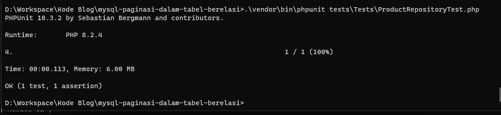

Ketika perangkat lunak sudah mulai kompleks, secara linear basis data juga akan ikut menjadi kompleks. Salah satu penyebab komplesitas antara lain semakin banyak nya jumlah tabel yang ada.

> [Tabel](https://en.wikipedia.org/wiki/Table_(database)) adalah kumpulan data terkait yang disimpan dalam format tabel dalam database . Terdiri dari kolom dan baris (wikipedia).

Dalam kasusnya, tabel (dalam [relational database](https://en.wikipedia.org/wiki/Relational_database)) akan dibuat berelasi sesuai sesuai dengan kebutuhannya. Relasi dibutuhkan agar [distribusi data semakin baik](https://en.wikipedia.org/wiki/Database_normalization). 

Dalam pengelolaan data, paginasi ([Pagination](https://en.wikipedia.org/wiki/Pagination)) dibutuhkan untuk memuat data dalam jumlah tertentu dengan tujuan mengurangi beban dari sumber daya ketika pengambilan data sedang berlangsung. Tidak ada masalah dengan hal itu, tetapi saat metode pengembangan menggunakan pendekatan Object Oriented, masalah mulai muncul ketika proses konversi atua _mapping_ data _(rows)_ ke dalam bentuk class _([Entity](https://stackoverflow.com/questions/2550197/whats-the-difference-between-entity-and-class))_. 

## Persiapan

Sebagai contoh kasus, bisa dibayangkan terdapat satu buah aplikasi untuk pengelolaan produk _(products)_ dan review _(reviews)_. Aplikasi pengelolaan produk mempunyai schema seperti berikut.



Dan sebagai sampel data kedua tabel diisi dengan data sebagai berikut.

Data dari tabel `products`,

```sql
mysql> select * from products; 
+----+-----------+--------+
| id | name      | price  |
+----+-----------+--------+
|  1 | T-shirt A | 100000 |
|  2 | T-shirt B | 150000 |
|  3 | T-shirt C | 150000 |
|  4 | T-shirt D | 200000 |
|  5 | T-shirt E | 500000 |
+----+-----------+--------+
5 rows in set (0.001 sec)
```
Dan data dari tabel `reviews` yang berelasi dengan tabel `products`,
```sql
mysql> select * from reviews;
+----+-----------+------------+
| id | review    | product_id |
+----+-----------+------------+
|  1 | Review A1 |          1 |
|  2 | Review A2 |          1 |
|  3 | Review A3 |          1 |
|  4 | Review A4 |          1 |
|  5 | Review A5 |          1 |
|  6 | Review A6 |          1 |
|  7 | Review B1 |          2 |
|  8 | Review B2 |          2 |
|  9 | Review B3 |          2 |
| 10 | Review B4 |          2 |
| 11 | Review D1 |          4 |
| 12 | Review D2 |          4 |
| 19 | Review E1 |          5 |
| 20 | Review E2 |          5 |
| 21 | Review E3 |          5 |
| 22 | Review E4 |          5 |
| 23 | Review E5 |          5 |
| 24 | Review E6 |          5 |
+----+-----------+------------+
18 rows in set (0.002 sec)
```

## Sumber Masalah
Dengan data seperti di atas, sekilah tidak terdeteksi adanya masalah. Ketika berusaha untuk mengambil data dari basis data menggunakan paginasi sederhana, maka nilai yang kita tampilkan terlihat normal-normal saja.

```sql
mysql> select p.id, p.name, p.price, r.id as review_id, r.review from products p left join reviews r on r.product_id = p.id limit 10 offset 0;
+----+-----------+--------+-----------+-----------+
| id | name      | price  | review_id | review    |
+----+-----------+--------+-----------+-----------+
|  1 | T-shirt A | 100000 |         1 | Review A1 |
|  1 | T-shirt A | 100000 |         2 | Review A2 |
|  1 | T-shirt A | 100000 |         3 | Review A3 |
|  1 | T-shirt A | 100000 |         4 | Review A4 |
|  1 | T-shirt A | 100000 |         5 | Review A5 |
|  1 | T-shirt A | 100000 |         6 | Review A6 |
|  2 | T-shirt B | 150000 |         7 | Review B1 |
|  2 | T-shirt B | 150000 |         8 | Review B2 |
|  2 | T-shirt B | 150000 |         9 | Review B3 |
|  2 | T-shirt B | 150000 |        10 | Review B4 |
+----+-----------+--------+-----------+-----------+
10 rows in set (0.002 sec)
```

Dari hasil query, data yang ditampilkan sesuai dengan jumlah query `limit` yang diinginkan, yakni 10. Dan ketika data coba dirubah ke dalam bentuk _entity class_ ternyata jumlah data tidak sesuai dengan kenyataannya.
```php
<?php  

class Product
{
    private int $id;

    private string $name;

    private float $price;

    private array $reviews = [];

    public function addReview(Review $review) 
    {
        // implementasi penambahan Entity Review ke $reviews[] sebagai relasi (one to many)
    }

    // baris selanjutnya adalah setter dan getter
}

class Review
{
    private int $id;

    private string $review;

    private int $product_id;

    // baris selanjutnya adalah setter dan getter
}


class ProductRepository 
{

    private PDO $dbh;

    public function getData(int $limit = 10, int $offset = 0) : array
    {
        // implemetasi bisa berbeda
        $query = "select p.id, p.name, p.price, r.id as review_id, r.review from products p left join reviews r on r.product_id = p.id limit :limit offset :offset";

        $stmt = $this->dbh->prepare($query);
        $stmt->bindParam(':limit', $limit, PDO::PARAM_INT);
        $stmt->bindParam(':offset', $offset, PDO::PARAM_INT);
        $stmt->execute();

        if ($stmt->rowCount() < 1) return [];

        $listProducts = [];
        $product = null;
        while ($row = $stmt->fetch(PDO::FETCH_ASSOC)) {
            if(is_null($product) || $product->getId() != $row['id']) {
                $product = new Product();
                $product->setId($row['id']);
                $product->setName($row['name']);
                $product->setPrice($row['price']);
            }

            if (is_null($row['review_id'])) continue;

            $review = new Review();
            $review->setId($row['review_id']);
            $review->setReview($row['review']);

            $product->addReview($review);

            $listProducts[$product->getId()] = $product;
        }

        return array_values($listProducts);
    }
}

```

Disaat kode coba dijalankan dan mendapatkan data hanya 2 baris (entity) saja.
```php
<?php

// kode import semua class

echo count((new ProductRepository())->getData()); // 2
``` 

Kenapa jumlah data yang tampil tidak sesuai yang diinginkan? 

Hal ini terjadi karena semua data yang di-_load_ dari basis data dimapping ke _parent entity_ yakni `Entity Product` yang relatif dengan jumlah relasi ke tabel review. 

Jika diperhatikan kembali data tabel di atas, pada bagian tabel product, data yang di-_load_ sebenarnya punya `id` hanya 2, yaitu `1` dan `2`, maka dari itu ketika di-_mapping_ hanya menghasilkan 2 entity Product saja. Sementara jumlah 10 data yang ditampilkan akibat dari relasi dengan tabel `reviews`.

Lantas bagaimana solusinya ? Sederhana saja, perbaiki query nya.

## Solusi

Saat permasalahan sudah teridentifikasi, maka solusi akan semakin mudah untuk didapatkan. Dalam kasus ini, solusi yang ditawarkan adalah dengan mengubah _query_ yang mengakomodasi agar 10 data dari tabel `products` berhasil ditampilkan.

### Limit di Tabel Utama _(parent)_

Untuk dapat mengakomodasi data ditampilkan sesuai dengan keinginan, kita perlu mempertimbangkan kembali dimana posisi `limit` harus diletakkan. Dalam hal ini karena data harus di-_limit_ mengikuti jumlah dari `Product` bukan hasil relasinya, maka limit di produk _(baca: tabel products)_ nya.
> Penting! Dalam contoh di bawah, dikarenakan jumlah data dalam tabel products hanya sebanyak 5 saja, maka jumlah data ditampilkan adalah 4 agar mendapatkan paginasi pada halaman berikut nya untuk menampilkan data ke 5 yang berjumlah 1.

```sql
mysql> select * from products limit 4 offset 0;
+----+-----------+--------+
| id | name      | price  |
+----+-----------+--------+
|  1 | T-shirt A | 100000 |
|  2 | T-shirt B | 150000 |
|  3 | T-shirt C | 150000 |
|  4 | T-shirt D | 200000 |
+----+-----------+--------+
4 rows in set (0.001 sec)
```
Dengan `limit 4 offset 0` maka sekarang kita berharap query relasi yang akan dibangun harus menampilkan data dari tabel `products` sebanyak 4 pula.

### Perbaikan Query

Hasil dari kesepakatan dalam pemindahan query `limit`, maka tabel `products` pada statement query sebelumnya perlu di-palsukan _(dengan sub-query)_.

> Relasi yang semula dilakukan dengan secara langsung antara tabel products dan tabel reviews diubah dengan menciptakan satu tabel bayangan 'q' yang merupakan data sebenarnya dari jumlah data yang diinginkan.

Maka, perbaikan query seharusnya adalah seperti berikut.

```sql
mysql> select p.id, p.name, p.price, r.id as review_id, r.review from (select q.* from products q limit 4 offset 0) p left join reviews r on r.product_id = p.id;
+----+-----------+--------+-----------+-----------+
| id | name      | price  | review_id | review    |
+----+-----------+--------+-----------+-----------+
|  1 | T-shirt A | 100000 |         1 | Review A1 |
|  1 | T-shirt A | 100000 |         2 | Review A2 |
|  1 | T-shirt A | 100000 |         3 | Review A3 |
|  1 | T-shirt A | 100000 |         4 | Review A4 |
|  1 | T-shirt A | 100000 |         5 | Review A5 |
|  1 | T-shirt A | 100000 |         6 | Review A6 |
|  2 | T-shirt B | 150000 |         7 | Review B1 |
|  2 | T-shirt B | 150000 |         8 | Review B2 |
|  2 | T-shirt B | 150000 |         9 | Review B3 |
|  2 | T-shirt B | 150000 |        10 | Review B4 |
|  3 | T-shirt C | 150000 |      NULL | NULL      |
|  4 | T-shirt D | 200000 |        11 | Review D1 |
|  4 | T-shirt D | 200000 |        12 | Review D2 |
+----+-----------+--------+-----------+-----------+
13 rows in set (0.008 sec)
```
Jika diperhatikan, jumlah data yang dikeluarkan adalah sebanyak `13`. Apa itu tidak salah? Tentu tidak, kita tidak perlu menghawatirkan berapa jumlah data yang dikeluarkan karena itu sangat relatif dengan relasinya.

Untuk lebih meyakinkan, coba perhatikan `id` atau `name` pada tabel `products` dan cocokkan dengan `id` atau `name` pada tabel `products`. Kedua data yang dihasilkan dipastikan sama sesuai keinginan, yaitu data dengan id 1, 2, 3 dan 4.

### Refactor Code

Setelah memahami dan berhasil melakukan perbaikan di-_level_ basis data, selanjunya mangadopsinya ke kode. Cukup mudah, cukup ganti isi `$query` dengan query yang baru.

```php
<?php

// baris kode lain

class ProductRepository 
{
    // kode lain
    public function getData(int $limit = 10, int $offset = 0) : array
    {
        $query = "select p.id, p.name, p.price, r.id as review_id, r.review from (select q.* from products q limit :limit offset :offset) p left join reviews r on r.product_id = p.id";

        // baris kode lain
    }
}

// baris kode lain
```

### Uji Coba

Setelah kode diperbaiki, seharusnya kita berekspektasi jumlah data yang ditampilkan adalah sebanyak 4. Jumlah data disesuikan dengan jumlah Entity `Product` yang seharusnya diload.

```php
<?php

echo count((new ProductRepository())->getData()); // 4
``` 

atau dalam testing,
```php
<?php

namespace Tests;

use App\Repository\ProductRepository;
use PHPUnit\Framework\TestCase;

class ProductRepositoryTest extends TestCase
{
    // kode lain

    public function testProductShouldReturn4ArrayAsExpectedTotalData()
    {
        $expectedTotalData = 4;

        // kode mockup
        /** @var PDO $mockDatabase */

        $repo = new ProductRepository($mockDatabase);
        $result = $repo->getData($expectedTotalData, 0);

        $this->assertCount($expectedTotalData, $result);
    }
}
```


## Kesimpulan

Paginasi dibutuhkan untuk mengurangi penggunaan _resource_ secara berlebihan, selain itu juga untuk memudahkan _end-user_ dalam memahami data yang ditampilkan. Dalam pendekatan object oriented menggunakan _Enitity Class_, diperlukan perhatian dalam melakukan __query limitasi__ agar sesuai saat dilakukan proses _mapping_ ke dalam bentuk _Entity Class_.

