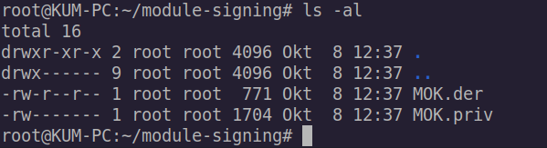

Saat kita berusaha menjalankan virtual box di sistem operasi Ubuntu (atau turunannya) dengan kondisi UEFI Secure Boot diaktifkan (enabled) maka pasti akan mengalami kegagalan. 


Dalam informasi kegagalan terdapat pesan berisi “If your system has EFI Secure Boot enabled you may also need to sign the kernel modules (vboxdrv, vboxnetflt, vboxnetadp, vboxpci) before you can load them…”. Pesan cukup jelas mengatakan bahwa, sistem UEFI harus ‘mengenali’ modul kernel yang akan dijalankan, dalam hal ini milik pihak ketiga yaitu VirtualBox.

Permasalahan ini sebenarnya bisa secara gampang diselesaikan dengan mematikan (disable) sistem UEFI yang mengakibatkan tidak ada lagi pengecekan apakah modul kernel yang dijalankan dikenali (trusted) atau tidak. 

Yaa, memang betul solusi itu berjalan, tetapi ada permasalahan muncul yang sedikit menjengkelkan (dan saya kurang suka),  dimana ketika akan booting  muncul pesan “booting in insecure mode” dan dikarenakan saya juga memakai Windows 11 (dual boot) malah tidak berjalan.

Jadi, itu bukan solusi yang cocok dan nyaman untuk saya.

## Mari Mengoprek

Silahkan buka terminal dan sekali lagi jalan virtualbox untuk melihat kembali pesan error.


Dalam pesan error, terdapat panduan untuk menajalankan perintah sudo /sbin/vboxconfig dan ikuti saja


Yapp, hanya ada pesan error lainnya, tetepi kita berhasil mendapatkan sedikit pencerahan bahwa dalam pesan error berkata “..You must sign these kernel module before using VirtualBox…”. Jadi, itulah solusinya, kita hanya perlu mendaftarkan modul kernel.

## Sign The Kernel

Dalam mendaftarkan kernel, kita perlu menbuat RSA key dengan openssl dan menyimpannya di direktori `/root/module-signing/`.

```bash
sodu -i
mkdir /root/module-signing
cd /root/module-signing/
openssl req -new -x509 -newkey rsa:2048 -keyout MOK.priv -outform DER -out MOK.der -nodes -days 36500 -subj "/CN=GANTI/"
```

> GANTI = ganti dengan teks apapun (tanpa spasi) seperti nama komputer atau apapun.

Key yang sudah dibuat bisa dengan perintah `ls -al`.



Jika key berhasil dibuat, kita perlu merubah ke mode ke `600`.

```bash
chmod 600 MOK.priv
```

Kemudian, pada terminal kita harus mengimport key yang telah dibuat menggunakan tool `mokutil`

```bash
mokutil –import MOK.der
```

Saat telah berhasil, maka silahkan reboot komputer dan saat booting, sistem akan masuk ke MOK Management, lalu tekan enter.


Pada menu MOK Management, 
1. pilih Enroll MOK

2. Pilih *`Continue`*

3. Pilih `Yes`, untuk konfirmasi Enroll Keys.

4. Masukkan password pada saat import keys di langkah sebelumnya.
5. Sistem akan reboot dan silahkan masuk lagi ke laptop anda.

Selanjutnya kita sign keys dari sesuai dengan kernel yang ada di sistem operasi, untuk mempermudah, silahkan buat _excutable file_ `/root/module-signing/sign-vbox-modules`dengan isi script,

```bash
#!/bin/bash

for modfile in $(dirname $(modinfo -n vboxdrv))/*.ko; do
	/usr/src/linux-headers-$(uname -r)/scripts/sign-file sha256 \
	/root/module-signing/MOK.priv \
	/root/module-signing/MOK.der "$modfile"
done
```

Simpan fle tersebut dan rubah mode ke executable.

```bash
chmod 700 /root/module-signing/sign-vbox-modules
```

Kemudian jalankan file tersebut.

```bash
cd /root/module-signing
./sign-vbox-modules
```

Load modul vboxdrv

```bash
modprobe vboxdrv
```

Dan jalankan kembali Virtual Box.


> UPDATE: perbaikan juga bisa dilakukan dengan menginstall ulang virtualbox-dkms dan (jika perlu) enroll key di MOK Management.


Referensi:
- [https://askubuntu.com/questions/912011/fatal-module-vboxdrv-not-found-in-directory-lib-modules-4-10-0-20-generic](https://askubuntu.com/questions/912011/fatal-module-vboxdrv-not-found-in-directory-lib-modules-4-10-0-20-generic)
- [https://stegard.net/2016/10/virtualbox-secure-boot-ubuntu-fail/](https://stegard.net/2016/10/virtualbox-secure-boot-ubuntu-fail/)